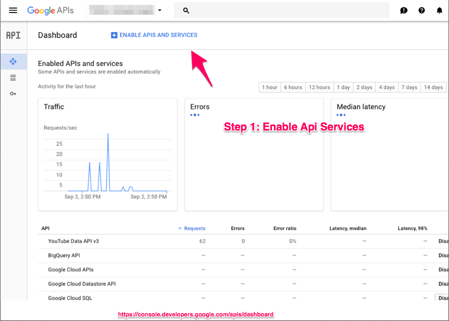
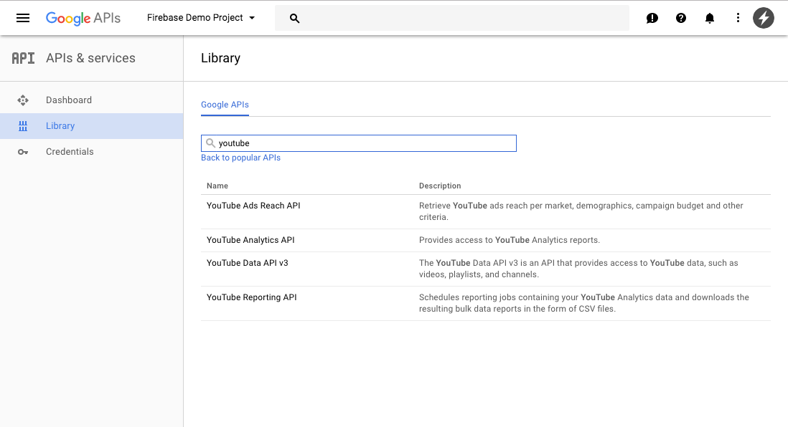
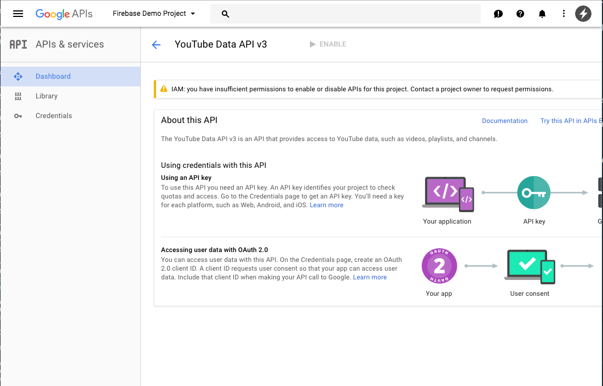
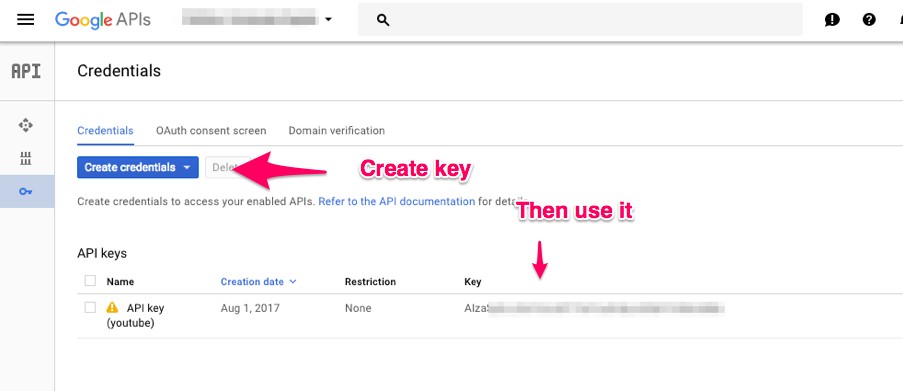

<p align="center">Meet ytube</p><p align="center"><a href="http://standardjs.com/"></a><a href="http://standardjs.com/"></a><a href="https://npmjs.org/package/ytube"></a><a href="https://npmjs.org/package/ytube"></a><a href="https://github.com/garrettmac/ytube/pulls?q=is:pr is:closed"></a><a href="https://github.com/garrettmac/ytube/issues?q=is:issue is:closed"></a>   <a></a><a></a><a><a></a><a href="https://gitter.im/garrettmac/ytube?utm_source=badge&utm_medium=badge&utm_campaign=pr-badge&utm_content=badge"></a></p>

# ytube

the easiest way to work with Youtube's API with beautify formatted `json` responses built on top of <a href="https://www.npmjs.com/package/youtube-node">youtube-node</a> and <a href="https://www.npmjs.com/package/axios">axios</a>

Give it a try using <a href="https://runkit.com">runkit</a>


## Getting Started


## Installation


```bash
yarn add ytube #(or with npm)
```


### Methods


|Method|Params|Description|
------------------------|--------|----------------
|fetchAllYouTube| `q`| combines the `search YouTube Channel`, `getChannelsPlayLists`, `getPlaylistVideos` methods to return one large object from a query |
|YouTubeAPI| `route`| `axios` instance|
|format| `data`,`hardFormat` (default `false`),`flattenThumbs` (default `false`) | formates the following <a href="https://developers.google.com/youtube/v3/getting-started#Sample_Partial_Requests">youtube kinds</a>: `youtube#channel`, `youtube#searchListResponse`, `youtube#channel`, `youtube#playlistListResponse`|
|YouTubeNode| `N/A` |`youtube-node` instance|
|getYouTubePlayListItems| `YouTubePlaylistId`|get YouTube PlayListItems|
|getYouTubeById| `id`|get YouTube ById|
|searchYouTubeChannel| `q` , `count` (default `1`)|search YouTube Channel|
|getYouTubeChannelVideos| `q` , `count` (default `5`)|get YouTube Channel Videos|
|getPlaylistVideos| `playListId` , `count` (default `5`|getPlaylistVideos|
  |getChannelsLatestVideos| `channelId`| get channels latest videos|
|getChannelsPlayLists| `channelId` , `count` (default `5`)|getChannelsPlayLists|
|getYouTubeVideoComments| `VideoID`|get YouTube Video Comments|
|YOUTUBE_API_KEY|  | Youtube api key|


## Set up

Getting API Key


<a href="https://console.developers.google.com/apis/dashboard"><b>Google Dashboard</b></a>
<p align="center">
  
</p>


<a href="https://console.developers.google.com/apis/library"><b>Google library</b></a>
<p align="center">
  
</p>

<a href="https://console.developers.google.com/apis/api/youtube.googleapis.com"><b>Youtube API</b></a>

<p align="center">
  
</p>

<a href="https://console.developers.google.com/apis/credentials"><b>Google credentials</b></a>
<p align="center">
  
</p>


 ###  axios instance

`YouTubeAPI` method under the hood

```js
get YouTubeAPI(){
  return axios.create({
  baseURL:`https://www.googleapis.com/youtube/v3`,
  responseType: "json",
  timeout: 5000,
  params:{
    key:this.YOUTUBE_API_KEY
  }
})
}
```

### Basic Usage

- In your `index.js`, use:
```js
import  YTube from 'ytube';
let ytube=new YTube("AIza****")//Youtube Api Key

ytube.fetchAllYouTube("MSNBC").then((value) => {
//see expandable for outbpt
}).catch((e)=>console.log(e))//if no "MSNBC" channel on youtube returns "No YouTube Channel"

```


<details>
<summary>fetchAllYouTube Success Output
</summary>

```json
{
  "publishedAt": "2006-06-17T16:34:17.000Z",
  "channelId": "UCvJJ_dzjViJCoLf5uKUTwoA",
  "title": "CNBC",
  "description": "Welcome to the official YouTube channel for CNBC. From 'Wall Street' to 'Main Street' to award winning original documentaries and Reality TV series, CNBC ...",
  "thumbnails": {
    "medium": "https://yt3.ggpht.com/-lhJTvOaoUoo/AAAAAAAAAAI/AAAAAAAAAAA/xLTHaLTLhwA/s240-c-k-no-mo-rj-c0xffffff/photo.jpg",
    "high": "https://yt3.ggpht.com/-lhJTvOaoUoo/AAAAAAAAAAI/AAAAAAAAAAA/xLTHaLTLhwA/s240-c-k-no-mo-rj-c0xffffff/photo.jpg"
  },
  "channelTitle": "CNBC",
  "liveBroadcastContent": "upcoming",
  "thumbnail": "https://yt3.ggpht.com/-lhJTvOaoUoo/AAAAAAAAAAI/AAAAAAAAAAA/xLTHaLTLhwA/s88-c-k-no-mo-rj-c0xffffff/photo.jpg",
  "kind": "youtube#channel",
  "playlists": [
    {
      "kind": "youtube#playlist",
      "playlistId": "PLDt0J62yU45vmJYhpMMmtD5GgBUP_zBUx",
      "publishedAt": "2017-07-14T20:31:59.000Z",
      "channelId": "UCvJJ_dzjViJCoLf5uKUTwoA",
      "title": "Top 5 States For Business | CNBC",
      "description": "",
      "itemCount": 0,
      "videos": [
        {
          "playlistItemId": "UExEdDBKNjJ5VTQ1dm1KWWhwTU1tdEQ1R2dCVVBfekJVeC41NkI0NEY2RDEwNTU3Q0M2",
          "publishedAt": "2017-07-14T20:33:18.000Z",
          "channelId": "UCvJJ_dzjViJCoLf5uKUTwoA",
          "title": "Top States Number 5: North Carolina | CNBC",
          "description": "The Tar Heel State ranked number five in the competition for Top States for Business, reports CNBC's Scott Cohn.\n» Subscribe to CNBC: http://cnb.cx/SubscribeCNBC\n\nAbout CNBC: From 'Wall Street' to 'Main Street' to award winning original documentaries and Reality TV series, CNBC has you covered. Experience special sneak peeks of your favorite shows, exclusive video and more.\n\nConnect with CNBC News Online\nGet the latest news: http://www.cnbc.com/\nFind CNBC News on Facebook: http://cnb.cx/LikeCNBC\nFollow CNBC News on Twitter: http://cnb.cx/FollowCNBC\nFollow CNBC News on Google+: http://cnb.cx/PlusCNBC\nFollow CNBC News on Instagram: http://cnb.cx/InstagramCNBC\n\nTop States Number 5: North Carolina | CNBC",
          "thumbnail": "https://i.ytimg.com/vi/aNgcQn6E1jQ/default.jpg",
          "thumbnails": {
            "medium": "https://i.ytimg.com/vi/aNgcQn6E1jQ/mqdefault.jpg",
            "high": "https://i.ytimg.com/vi/aNgcQn6E1jQ/hqdefault.jpg",
            "standard": "https://i.ytimg.com/vi/aNgcQn6E1jQ/sddefault.jpg"
          }
        },
        {
          "playlistItemId": "UExEdDBKNjJ5VTQ1dm1KWWhwTU1tdEQ1R2dCVVBfekJVeC4yODlGNEE0NkRGMEEzMEQy",
          "publishedAt": "2017-07-14T20:34:40.000Z",
          "channelId": "UCvJJ_dzjViJCoLf5uKUTwoA",
          "title": "Minnesota Ranks 3rd In America's Top States For Business | CNBC",
          "description": "CNBC's Scott Cohn reports the North Star State ranked second in education and moved up a notch from last year's ranking, but it's expensive to live there.\n» Subscribe to CNBC: http://cnb.cx/SubscribeCNBC\n\nAbout CNBC: From 'Wall Street' to 'Main Street' to award winning original documentaries and Reality TV series, CNBC has you covered. Experience special sneak peeks of your favorite shows, exclusive video and more.\n\nConnect with CNBC News Online\nGet the latest news: http://www.cnbc.com/\nFind CNBC News on Facebook: http://cnb.cx/LikeCNBC\nFollow CNBC News on Twitter: http://cnb.cx/FollowCNBC\nFollow CNBC News on Google+: http://cnb.cx/PlusCNBC\nFollow CNBC News on Instagram: http://cnb.cx/InstagramCNBC\n\nMinnesota Ranks 3rd In America's Top States For Business | CNBC",
          "thumbnail": "https://i.ytimg.com/vi/l1rzop9ZSnQ/default.jpg",
          "thumbnails": {
            "medium": "https://i.ytimg.com/vi/l1rzop9ZSnQ/mqdefault.jpg",
            "high": "https://i.ytimg.com/vi/l1rzop9ZSnQ/hqdefault.jpg",
            "standard": "https://i.ytimg.com/vi/l1rzop9ZSnQ/sddefault.jpg"
          }
        },
        {
          "playlistItemId": "UExEdDBKNjJ5VTQ1dm1KWWhwTU1tdEQ1R2dCVVBfekJVeC4wMTcyMDhGQUE4NTIzM0Y5",
          "publishedAt": "2017-07-14T20:34:40.000Z",
          "channelId": "UCvJJ_dzjViJCoLf5uKUTwoA",
          "title": "Texas Drops To 4th Place In Top States For Business | CNBC",
          "description": "CNBC's Scott Cohn reports on the Top States for Business in America and reveals that Texas, while overall placing fourth, is the top state for infrastructure.\n» Subscribe to CNBC: http://cnb.cx/SubscribeCNBC\n\nAbout CNBC: From 'Wall Street' to 'Main Street' to award winning original documentaries and Reality TV series, CNBC has you covered. Experience special sneak peeks of your favorite shows, exclusive video and more.\n\nConnect with CNBC News Online\nGet the latest news: http://www.cnbc.com/\nFind CNBC News on Facebook: http://cnb.cx/LikeCNBC\nFollow CNBC News on Twitter: http://cnb.cx/FollowCNBC\nFollow CNBC News on Google+: http://cnb.cx/PlusCNBC\nFollow CNBC News on Instagram: http://cnb.cx/InstagramCNBC\n\nTexas Drops To 4th Place In Top States For Business | CNBC",
          "thumbnail": "https://i.ytimg.com/vi/wh5ay3L5SMg/default.jpg",
          "thumbnails": {
            "medium": "https://i.ytimg.com/vi/wh5ay3L5SMg/mqdefault.jpg",
            "high": "https://i.ytimg.com/vi/wh5ay3L5SMg/hqdefault.jpg",
            "standard": "https://i.ytimg.com/vi/wh5ay3L5SMg/sddefault.jpg"
          }
        },
        {
          "playlistItemId": "UExEdDBKNjJ5VTQ1dm1KWWhwTU1tdEQ1R2dCVVBfekJVeC41MjE1MkI0OTQ2QzJGNzNG",
          "publishedAt": "2017-07-14T20:35:21.000Z",
          "channelId": "UCvJJ_dzjViJCoLf5uKUTwoA",
          "title": "Georgia The Second Top State For Business | CNBC",
          "description": "CNBC's Scott Cohn reveals Georgia as the second Top State for Business, with strengths including its economy, workforce, and infrastructure.\n» Subscribe to CNBC: http://cnb.cx/SubscribeCNBC\n\nAbout CNBC: From 'Wall Street' to 'Main Street' to award winning original documentaries and Reality TV series, CNBC has you covered. Experience special sneak peeks of your favorite shows, exclusive video and more.\n\nConnect with CNBC News Online\nGet the latest news: http://www.cnbc.com/\nFind CNBC News on Facebook: http://cnb.cx/LikeCNBC\nFollow CNBC News on Twitter: http://cnb.cx/FollowCNBC\nFollow CNBC News on Google+: http://cnb.cx/PlusCNBC\nFollow CNBC News on Instagram: http://cnb.cx/InstagramCNBC\n\nGeorgia The Second Top State For Business | CNBC",
          "thumbnail": "https://i.ytimg.com/vi/PrTAPDiAiek/default.jpg",
          "thumbnails": {
            "medium": "https://i.ytimg.com/vi/PrTAPDiAiek/mqdefault.jpg",
            "high": "https://i.ytimg.com/vi/PrTAPDiAiek/hqdefault.jpg",
            "standard": "https://i.ytimg.com/vi/PrTAPDiAiek/sddefault.jpg"
          }
        },
        {
          "playlistItemId": "UExEdDBKNjJ5VTQ1dm1KWWhwTU1tdEQ1R2dCVVBfekJVeC4wOTA3OTZBNzVEMTUzOTMy",
          "publishedAt": "2017-07-14T20:36:38.000Z",
          "channelId": "UCvJJ_dzjViJCoLf5uKUTwoA",
          "title": "Washington Is CNBC's Top State For Business | CNBC",
          "description": "CNBC's Scott Cohn reveals Washington as the Top State for Business, with strengths including the economy and technology and innovation. He speaks with Governor Jay Inslee (D-Wash.).\n» Subscribe to CNBC: http://cnb.cx/SubscribeCNBC\n\nAbout CNBC: From 'Wall Street' to 'Main Street' to award winning original documentaries and Reality TV series, CNBC has you covered. Experience special sneak peeks of your favorite shows, exclusive video and more.\n\nConnect with CNBC News Online\nGet the latest news: http://www.cnbc.com/\nFind CNBC News on Facebook: http://cnb.cx/LikeCNBC\nFollow CNBC News on Twitter: http://cnb.cx/FollowCNBC\nFollow CNBC News on Google+: http://cnb.cx/PlusCNBC\nFollow CNBC News on Instagram: http://cnb.cx/InstagramCNBC\n\nWashington Is CNBC's Top State For Business | CNBC",
          "thumbnail": "https://i.ytimg.com/vi/-mikWlvO15w/default.jpg",
          "thumbnails": {
            "medium": "https://i.ytimg.com/vi/-mikWlvO15w/mqdefault.jpg",
            "high": "https://i.ytimg.com/vi/-mikWlvO15w/hqdefault.jpg",
            "standard": "https://i.ytimg.com/vi/-mikWlvO15w/sddefault.jpg"
          }
        }
      ]
    },
    {
      "kind": "youtube#playlist",
      "playlistId": "PLDt0J62yU45sVWRXsmT-cc64uOpC-30p9",
      "publishedAt": "2017-06-13T19:09:13.000Z",
      "channelId": "UCvJJ_dzjViJCoLf5uKUTwoA",
      "title": "Jeff Sessions Testimony Before Senate Intelligence Committee | CNBC",
      "description": "",
      "itemCount": 0,
      "videos": [
        {
          "playlistItemId": "UExEdDBKNjJ5VTQ1c1ZXUlhzbVQtY2M2NHVPcEMtMzBwOS41NkI0NEY2RDEwNTU3Q0M2",
          "publishedAt": "2017-06-13T19:55:05.000Z",
          "channelId": "UCvJJ_dzjViJCoLf5uKUTwoA",
          "title": "Sen. Richard Burr: This Is AG Jeff Sessions' Opportunity To Separate Fact From Fiction | CNBC",
          "description": "At a hearing of the Senate Select Committee on Intelligence, Committee Chair Sen. Richard Burr (R-N.C.) makes opening remarks ahead of Attorney General Jeff Sessions' testimony.\n» Subscribe to CNBC: http://cnb.cx/SubscribeCNBC\n\nAbout CNBC: From 'Wall Street' to 'Main Street' to award winning original documentaries and Reality TV series, CNBC has you covered. Experience special sneak peeks of your favorite shows, exclusive video and more.\n\nConnect with CNBC News Online\nGet the latest news: http://www.cnbc.com/\nFind CNBC News on Facebook: http://cnb.cx/LikeCNBC\nFollow CNBC News on Twitter: http://cnb.cx/FollowCNBC\nFollow CNBC News on Google+: http://cnb.cx/PlusCNBC\nFollow CNBC News on Instagram: http://cnb.cx/InstagramCNBC\n\nSen. Richard Burr: This Is AG Jeff Sessions' Opportunity To Separate Fact From Fiction | CNBC",
          "thumbnail": "https://i.ytimg.com/vi/-3Na8tBOQsM/default.jpg",
          "thumbnails": {
            "medium": "https://i.ytimg.com/vi/-3Na8tBOQsM/mqdefault.jpg",
            "high": "https://i.ytimg.com/vi/-3Na8tBOQsM/hqdefault.jpg",
            "standard": "https://i.ytimg.com/vi/-3Na8tBOQsM/sddefault.jpg"
          }
        },
        {
          "playlistItemId": "UExEdDBKNjJ5VTQ1c1ZXUlhzbVQtY2M2NHVPcEMtMzBwOS4yODlGNEE0NkRGMEEzMEQy",
          "publishedAt": "2017-06-13T20:00:45.000Z",
          "channelId": "UCvJJ_dzjViJCoLf5uKUTwoA",
          "title": "AG Sessions: Cannot Violate My Duty To Protect Confidential Communications With President | CNBC",
          "description": "At a hearing in front of the Senate Select Committee on Intelligence, Attorney General Jeff Sessions gives his prepared testimony.\n» Subscribe to CNBC: http://cnb.cx/SubscribeCNBC\n\nAbout CNBC: From 'Wall Street' to 'Main Street' to award winning original documentaries and Reality TV series, CNBC has you covered. Experience special sneak peeks of your favorite shows, exclusive video and more.\n\nConnect with CNBC News Online\nGet the latest news: http://www.cnbc.com/\nFind CNBC News on Facebook: http://cnb.cx/LikeCNBC\nFollow CNBC News on Twitter: http://cnb.cx/FollowCNBC\nFollow CNBC News on Google+: http://cnb.cx/PlusCNBC\nFollow CNBC News on Instagram: http://cnb.cx/InstagramCNBC\n\nAG Sessions: Cannot Violate My Duty To Protect Confidential Communications With President | CNBC",
          "thumbnail": "https://i.ytimg.com/vi/I668sP6PcWg/default.jpg",
          "thumbnails": {
            "medium": "https://i.ytimg.com/vi/I668sP6PcWg/mqdefault.jpg",
            "high": "https://i.ytimg.com/vi/I668sP6PcWg/hqdefault.jpg",
            "standard": "https://i.ytimg.com/vi/I668sP6PcWg/sddefault.jpg"
          }
        },
        {
          "playlistItemId": "UExEdDBKNjJ5VTQ1c1ZXUlhzbVQtY2M2NHVPcEMtMzBwOS4wMTcyMDhGQUE4NTIzM0Y5",
          "publishedAt": "2017-06-13T21:35:34.000Z",
          "channelId": "UCvJJ_dzjViJCoLf5uKUTwoA",
          "title": "AG Jeff Sessions: James Comey Was Sent An Email On My Recusal | CNBC",
          "description": "At a hearing in front of the Senate Select Committee on Intelligence, Attorney General Jeff Sessions answers questions from Committee Chair Sen. Richard Burr (R-N.C.) about Former FBI Director James Comey's testimony to the committee.\n» Subscribe to CNBC: http://cnb.cx/SubscribeCNBC\n\nAbout CNBC: From 'Wall Street' to 'Main Street' to award winning original documentaries and Reality TV series, CNBC has you covered. Experience special sneak peeks of your favorite shows, exclusive video and more.\n\nConnect with CNBC News Online\nGet the latest news: http://www.cnbc.com/\nFind CNBC News on Facebook: http://cnb.cx/LikeCNBC\nFollow CNBC News on Twitter: http://cnb.cx/FollowCNBC\nFollow CNBC News on Google+: http://cnb.cx/PlusCNBC\nFollow CNBC News on Instagram: http://cnb.cx/InstagramCNBC\n\nAG Jeff Sessions: James Comey Was Sent An Email On My Recusal | CNBC",
          "thumbnail": "https://i.ytimg.com/vi/6AT1NokVm3k/default.jpg",
          "thumbnails": {
            "medium": "https://i.ytimg.com/vi/6AT1NokVm3k/mqdefault.jpg",
            "high": "https://i.ytimg.com/vi/6AT1NokVm3k/hqdefault.jpg",
            "standard": "https://i.ytimg.com/vi/6AT1NokVm3k/sddefault.jpg"
          }
        },
        {
          "playlistItemId": "UExEdDBKNjJ5VTQ1c1ZXUlhzbVQtY2M2NHVPcEMtMzBwOS41MjE1MkI0OTQ2QzJGNzNG",
          "publishedAt": "2017-06-13T21:37:54.000Z",
          "channelId": "UCvJJ_dzjViJCoLf5uKUTwoA",
          "title": "Attorney General Jeff Sessions : My Recusal Was Result Of DOJ Regulation | CNBC",
          "description": "At a hearing in front of the Senate Select Committee on Intelligence, Attorney General Jeff Sessions gives his prepared testimony.\n» Subscribe to CNBC: http://cnb.cx/SubscribeCNBC\n\nAbout CNBC: From 'Wall Street' to 'Main Street' to award winning original documentaries and Reality TV series, CNBC has you covered. Experience special sneak peeks of your favorite shows, exclusive video and more.\n\nConnect with CNBC News Online\nGet the latest news: http://www.cnbc.com/\nFind CNBC News on Facebook: http://cnb.cx/LikeCNBC\nFollow CNBC News on Twitter: http://cnb.cx/FollowCNBC\nFollow CNBC News on Google+: http://cnb.cx/PlusCNBC\nFollow CNBC News on Instagram: http://cnb.cx/InstagramCNBC\n\nAttorney General Jeff Sessions : My Recusal Was Result Of DOJ Regulation | CNBC",
          "thumbnail": "https://i.ytimg.com/vi/9lDQGHlL4C4/default.jpg",
          "thumbnails": {
            "medium": "https://i.ytimg.com/vi/9lDQGHlL4C4/mqdefault.jpg",
            "high": "https://i.ytimg.com/vi/9lDQGHlL4C4/hqdefault.jpg",
            "standard": "https://i.ytimg.com/vi/9lDQGHlL4C4/sddefault.jpg"
          }
        },
        {
          "playlistItemId": "UExEdDBKNjJ5VTQ1c1ZXUlhzbVQtY2M2NHVPcEMtMzBwOS4wOTA3OTZBNzVEMTUzOTMy",
          "publishedAt": "2017-06-13T21:39:12.000Z",
          "channelId": "UCvJJ_dzjViJCoLf5uKUTwoA",
          "title": "AG Jeff Sessions: I Did Respond To James Comey On Communications Protocol With White House | CNBC",
          "description": "At a hearing in front of the Senate Select Committee on Intelligence, Attorney General Jeff Sessions gives his prepared testimony.\n» Subscribe to CNBC: http://cnb.cx/SubscribeCNBC\n\nAbout CNBC: From 'Wall Street' to 'Main Street' to award winning original documentaries and Reality TV series, CNBC has you covered. Experience special sneak peeks of your favorite shows, exclusive video and more.\n\nConnect with CNBC News Online\nGet the latest news: http://www.cnbc.com/\nFind CNBC News on Facebook: http://cnb.cx/LikeCNBC\nFollow CNBC News on Twitter: http://cnb.cx/FollowCNBC\nFollow CNBC News on Google+: http://cnb.cx/PlusCNBC\nFollow CNBC News on Instagram: http://cnb.cx/InstagramCNBC\n\nAG Jeff Sessions: I Did Respond To James Comey On Communications Protocol With White House | CNBC",
          "thumbnail": "https://i.ytimg.com/vi/tyl7wqwDaSQ/default.jpg",
          "thumbnails": {
            "medium": "https://i.ytimg.com/vi/tyl7wqwDaSQ/mqdefault.jpg",
            "high": "https://i.ytimg.com/vi/tyl7wqwDaSQ/hqdefault.jpg",
            "standard": "https://i.ytimg.com/vi/tyl7wqwDaSQ/sddefault.jpg"
          }
        }
      ]
    },
    {
      "kind": "youtube#playlist",
      "playlistId": "PLDt0J62yU45sNcdJgKaegX_tqdV0NR1Z6",
      "publishedAt": "2017-06-08T14:20:48.000Z",
      "channelId": "UCvJJ_dzjViJCoLf5uKUTwoA",
      "title": "James Comey Testimony Before Senate Intelligence Committee | CNBC",
      "description": "",
      "itemCount": 0,
      "videos": [
        {
          "playlistItemId": "UExEdDBKNjJ5VTQ1c05jZEpnS2FlZ1hfdHFkVjBOUjFaNi40NzZCMERDMjVEN0RFRThB",
          "publishedAt": "2017-06-09T15:54:57.000Z",
          "channelId": "UCvJJ_dzjViJCoLf5uKUTwoA",
          "title": "Preet Bharara, President Trump's Sons Tweet Up A Storm During James Comey's Hearing | CNBC",
          "description": "Twitter reacts to James Comey's testimony.\n» Subscribe to CNBC: http://cnb.cx/SubscribeCNBC\n\nAbout CNBC: From 'Wall Street' to 'Main Street' to award winning original documentaries and Reality TV series, CNBC has you covered. Experience special sneak peeks of your favorite shows, exclusive video and more.\n\nConnect with CNBC News Online\nGet the latest news: http://www.cnbc.com/\nFind CNBC News on Facebook: http://cnb.cx/LikeCNBC\nFollow CNBC News on Twitter: http://cnb.cx/FollowCNBC\nFollow CNBC News on Google+: http://cnb.cx/PlusCNBC\nFollow CNBC News on Instagram: http://cnb.cx/InstagramCNBC\n\nPreet Bharara, President Trump's Sons Tweet Up A Storm During James Comey's Hearing | CNBC",
          "thumbnail": "https://i.ytimg.com/vi/edA4D_7k82k/default.jpg",
          "thumbnails": {
            "medium": "https://i.ytimg.com/vi/edA4D_7k82k/mqdefault.jpg",
            "high": "https://i.ytimg.com/vi/edA4D_7k82k/hqdefault.jpg",
            "standard": "https://i.ytimg.com/vi/edA4D_7k82k/sddefault.jpg"
          }
        },
        {
          "playlistItemId": "UExEdDBKNjJ5VTQ1c05jZEpnS2FlZ1hfdHFkVjBOUjFaNi5GNjNDRDREMDQxOThCMDQ2",
          "publishedAt": "2017-06-09T13:57:30.000Z",
          "channelId": "UCvJJ_dzjViJCoLf5uKUTwoA",
          "title": "Former FBI Director James Comey's Full Testimony Before Senate Intelligence Committee | CNBC",
          "description": "Former FBI Director James Comey testified before the Senate Select Intelligence Committee on Thursday as he faced questions over whether Donald Trump attempted to quash the investigation into former National Security Advisor Michael Flynn's ties with Russia.\n» Subscribe to CNBC: http://cnb.cx/SubscribeCNBC\n\nAbout CNBC: From 'Wall Street' to 'Main Street' to award winning original documentaries and Reality TV series, CNBC has you covered. Experience special sneak peeks of your favorite shows, exclusive video and more.\n\nConnect with CNBC News Online\nGet the latest news: http://www.cnbc.com/\nFind CNBC News on Facebook: http://cnb.cx/LikeCNBC\nFollow CNBC News on Twitter: http://cnb.cx/FollowCNBC\nFollow CNBC News on Google+: http://cnb.cx/PlusCNBC\nFollow CNBC News on Instagram: http://cnb.cx/InstagramCNBC\n\nFormer FBI Director James Comey's Full Testimony Before Senate Intelligence Committee | CNBC",
          "thumbnail": "https://i.ytimg.com/vi/ja-d0VG3qbU/default.jpg",
          "thumbnails": {
            "medium": "https://i.ytimg.com/vi/ja-d0VG3qbU/mqdefault.jpg",
            "high": "https://i.ytimg.com/vi/ja-d0VG3qbU/hqdefault.jpg",
            "standard": "https://i.ytimg.com/vi/ja-d0VG3qbU/sddefault.jpg"
          }
        },
        {
          "playlistItemId": "UExEdDBKNjJ5VTQ1c05jZEpnS2FlZ1hfdHFkVjBOUjFaNi45NDk1REZENzhEMzU5MDQz",
          "publishedAt": "2017-06-08T19:28:20.000Z",
          "channelId": "UCvJJ_dzjViJCoLf5uKUTwoA",
          "title": "John McCain At Senate Hearing: We're Living An 'Orwellian Existence' | CNBC",
          "description": "U.S. Sen. John McCain, R-Ariz, said Wednesday that Director of National Intelligence Dan Coats' refusal to go into detail about a conversation already reported in The Washington Post \"shows what kind of an Orwellian existence that we live in.\"\n» Subscribe to CNBC: http://cnb.cx/SubscribeCNBC\n\nAbout CNBC: From 'Wall Street' to 'Main Street' to award winning original documentaries and Reality TV series, CNBC has you covered. Experience special sneak peeks of your favorite shows, exclusive video and more.\n\nConnect with CNBC News Online\nGet the latest news: http://www.cnbc.com/\nFind CNBC News on Facebook: http://cnb.cx/LikeCNBC\nFollow CNBC News on Twitter: http://cnb.cx/FollowCNBC\nFollow CNBC News on Google+: http://cnb.cx/PlusCNBC\nFollow CNBC News on Instagram: http://cnb.cx/InstagramCNBC\n\nJohn McCain At Senate Hearing: We're Living An 'Orwellian Existence' | CNBC",
          "thumbnail": "https://i.ytimg.com/vi/Y09NlpRnyJ8/default.jpg",
          "thumbnails": {
            "medium": "https://i.ytimg.com/vi/Y09NlpRnyJ8/mqdefault.jpg",
            "high": "https://i.ytimg.com/vi/Y09NlpRnyJ8/hqdefault.jpg",
            "standard": "https://i.ytimg.com/vi/Y09NlpRnyJ8/sddefault.jpg"
          }
        },
        {
          "playlistItemId": "UExEdDBKNjJ5VTQ1c05jZEpnS2FlZ1hfdHFkVjBOUjFaNi5DQUNERDQ2NkIzRUQxNTY1",
          "publishedAt": "2017-06-08T19:16:33.000Z",
          "channelId": "UCvJJ_dzjViJCoLf5uKUTwoA",
          "title": "James Comey To Senators: Russian Interference 'Will Be Back' | CNBC",
          "description": "In a hearing in front of the Senate Select Intelligence Committee, Former FBI Director James Comey answers questions from Sen. Angus King (I-Maine) about Russian involvement in the 2016 election and other related investigations.\n» Subscribe to CNBC: http://cnb.cx/SubscribeCNBC\n\nAbout CNBC: From 'Wall Street' to 'Main Street' to award winning original documentaries and Reality TV series, CNBC has you covered. Experience special sneak peeks of your favorite shows, exclusive video and more.\n\nConnect with CNBC News Online\nGet the latest news: http://www.cnbc.com/\nFind CNBC News on Facebook: http://cnb.cx/LikeCNBC\nFollow CNBC News on Twitter: http://cnb.cx/FollowCNBC\nFollow CNBC News on Google+: http://cnb.cx/PlusCNBC\nFollow CNBC News on Instagram: http://cnb.cx/InstagramCNBC\n\nJames Comey To Senators: Russian Interference 'Will Be Back' | CNBC",
          "thumbnail": "https://i.ytimg.com/vi/MgNXUXpOAsE/default.jpg",
          "thumbnails": {
            "medium": "https://i.ytimg.com/vi/MgNXUXpOAsE/mqdefault.jpg",
            "high": "https://i.ytimg.com/vi/MgNXUXpOAsE/hqdefault.jpg",
            "standard": "https://i.ytimg.com/vi/MgNXUXpOAsE/sddefault.jpg"
          }
        },
        {
          "playlistItemId": "UExEdDBKNjJ5VTQ1c05jZEpnS2FlZ1hfdHFkVjBOUjFaNi41MzJCQjBCNDIyRkJDN0VD",
          "publishedAt": "2017-06-08T17:11:47.000Z",
          "channelId": "UCvJJ_dzjViJCoLf5uKUTwoA",
          "title": "James Comey's Testimony 'Must-See TV': Free Drinks And Canceled Meetings | CNBC",
          "description": "Millions expected to pause work Thursday morning to watch James Comey's testimony.\n» Subscribe to CNBC: http://cnb.cx/SubscribeCNBC\n\nAbout CNBC: From 'Wall Street' to 'Main Street' to award winning original documentaries and Reality TV series, CNBC has you covered. Experience special sneak peeks of your favorite shows, exclusive video and more.\n\nConnect with CNBC News Online\nGet the latest news: http://www.cnbc.com/\nFind CNBC News on Facebook: http://cnb.cx/LikeCNBC\nFollow CNBC News on Twitter: http://cnb.cx/FollowCNBC\nFollow CNBC News on Google+: http://cnb.cx/PlusCNBC\nFollow CNBC News on Instagram: http://cnb.cx/InstagramCNBC\n\nJames Comey's Testimony 'Must-See TV': Free Drinks And Canceled Meetings | CNBC",
          "thumbnail": "https://i.ytimg.com/vi/xC4n2PQESBU/default.jpg",
          "thumbnails": {
            "medium": "https://i.ytimg.com/vi/xC4n2PQESBU/mqdefault.jpg",
            "high": "https://i.ytimg.com/vi/xC4n2PQESBU/hqdefault.jpg",
            "standard": "https://i.ytimg.com/vi/xC4n2PQESBU/sddefault.jpg"
          }
        }
      ]
    },
    {
      "kind": "youtube#playlist",
      "playlistId": "PLDt0J62yU45sgpLodUa-a7CrYp4i-1VDz",
      "publishedAt": "2017-06-07T20:23:37.000Z",
      "channelId": "UCvJJ_dzjViJCoLf5uKUTwoA",
      "title": "iConic Conference 2017 | CNBC",
      "description": "",
      "itemCount": 0,
      "videos": [
        {
          "playlistItemId": "UExEdDBKNjJ5VTQ1c2dwTG9kVWEtYTdDcllwNGktMVZEei5GM0Q3M0MzMzY5NTJFNTdE",
          "publishedAt": "2017-06-15T19:20:37.000Z",
          "channelId": "UCvJJ_dzjViJCoLf5uKUTwoA",
          "title": "The Best Of iCONIC NY | CNBC",
          "description": "CNBC’s Susan Li takes a deep dive into all the action that has taken place on the iCONIC NY stage on June 7, 2017, from special guests to the very best stage moments.\n» Subscribe to CNBC: http://cnb.cx/SubscribeCNBC\n\nAbout CNBC: From 'Wall Street' to 'Main Street' to award winning original documentaries and Reality TV series, CNBC has you covered. Experience special sneak peeks of your favorite shows, exclusive video and more.\n\nConnect with CNBC News Online\nGet the latest news: http://www.cnbc.com/\nFind CNBC News on Facebook: http://cnb.cx/LikeCNBC\nFollow CNBC News on Twitter: http://cnb.cx/FollowCNBC\nFollow CNBC News on Google+: http://cnb.cx/PlusCNBC\nFollow CNBC News on Instagram: http://cnb.cx/InstagramCNBC\n\nThe Best Of iCONIC NY | CNBC",
          "thumbnail": "https://i.ytimg.com/vi/2EPEn3hyIXI/default.jpg",
          "thumbnails": {
            "medium": "https://i.ytimg.com/vi/2EPEn3hyIXI/mqdefault.jpg",
            "high": "https://i.ytimg.com/vi/2EPEn3hyIXI/hqdefault.jpg",
            "standard": "https://i.ytimg.com/vi/2EPEn3hyIXI/sddefault.jpg"
          }
        },
        {
          "playlistItemId": "UExEdDBKNjJ5VTQ1c2dwTG9kVWEtYTdDcllwNGktMVZEei4yMDhBMkNBNjRDMjQxQTg1",
          "publishedAt": "2017-06-15T19:09:31.000Z",
          "channelId": "UCvJJ_dzjViJCoLf5uKUTwoA",
          "title": "Swimming With The People’s Shark: Daymond John | CNBC",
          "description": "CNBC co-anchor Carl Quintanilla speaks with Shark Tank co-star and FUBU founder Daymond John, to discuss the keys to entrepreneurial success at iCONIC NY on June 7, 2017.\n» Subscribe to CNBC: http://cnb.cx/SubscribeCNBC\n\nAbout CNBC: From 'Wall Street' to 'Main Street' to award winning original documentaries and Reality TV series, CNBC has you covered. Experience special sneak peeks of your favorite shows, exclusive video and more.\n\nConnect with CNBC News Online\nGet the latest news: http://www.cnbc.com/\nFind CNBC News on Facebook: http://cnb.cx/LikeCNBC\nFollow CNBC News on Twitter: http://cnb.cx/FollowCNBC\nFollow CNBC News on Google+: http://cnb.cx/PlusCNBC\nFollow CNBC News on Instagram: http://cnb.cx/InstagramCNBC\n\nSwimming With The People’s Shark: Daymond John | CNBC",
          "thumbnail": "https://i.ytimg.com/vi/7VKn2GbXf_Y/default.jpg",
          "thumbnails": {
            "medium": "https://i.ytimg.com/vi/7VKn2GbXf_Y/mqdefault.jpg",
            "high": "https://i.ytimg.com/vi/7VKn2GbXf_Y/hqdefault.jpg",
            "standard": "https://i.ytimg.com/vi/7VKn2GbXf_Y/sddefault.jpg"
          }
        },
        {
          "playlistItemId": "UExEdDBKNjJ5VTQ1c2dwTG9kVWEtYTdDcllwNGktMVZEei5ENDU4Q0M4RDExNzM1Mjcy",
          "publishedAt": "2017-06-15T19:02:51.000Z",
          "channelId": "UCvJJ_dzjViJCoLf5uKUTwoA",
          "title": "Strategies For Success From S'Well Founder Sara Kauss | CNBC",
          "description": "CNBC’s Susan Li is joined by Aaron Krause, Scrub Daddy, S’Well founder Sara Kauss and Sarah Robb O’Hagan of Flywheel Sports at iCONIC NY on June 7, 2017.\n» Subscribe to CNBC: http://cnb.cx/SubscribeCNBC\n\nAbout CNBC: From 'Wall Street' to 'Main Street' to award winning original documentaries and Reality TV series, CNBC has you covered. Experience special sneak peeks of your favorite shows, exclusive video and more.\n\nConnect with CNBC News Online\nGet the latest news: http://www.cnbc.com/\nFind CNBC News on Facebook: http://cnb.cx/LikeCNBC\nFollow CNBC News on Twitter: http://cnb.cx/FollowCNBC\nFollow CNBC News on Google+: http://cnb.cx/PlusCNBC\nFollow CNBC News on Instagram: http://cnb.cx/InstagramCNBC\n\nStrategies For Success From S'Well Founder Sara Kauss | CNBC",
          "thumbnail": "https://i.ytimg.com/vi/Sum4QUiSz1Q/default.jpg",
          "thumbnails": {
            "medium": "https://i.ytimg.com/vi/Sum4QUiSz1Q/mqdefault.jpg",
            "high": "https://i.ytimg.com/vi/Sum4QUiSz1Q/hqdefault.jpg",
            "standard": "https://i.ytimg.com/vi/Sum4QUiSz1Q/sddefault.jpg"
          }
        },
        {
          "playlistItemId": "UExEdDBKNjJ5VTQ1c2dwTG9kVWEtYTdDcllwNGktMVZEei45RTgxNDRBMzUwRjQ0MDhC",
          "publishedAt": "2017-06-15T14:55:00.000Z",
          "channelId": "UCvJJ_dzjViJCoLf5uKUTwoA",
          "title": "The Buzz At iCONIC NY | CNBC",
          "description": "CNBC’s Susan Li covers the buzz surrounding this year’s iCONIC conference on June 7, 2017 and takes a look at some of the top moments in iCONIC history.\n» Subscribe to CNBC: http://cnb.cx/SubscribeCNBC\n\nAbout CNBC: From 'Wall Street' to 'Main Street' to award winning original documentaries and Reality TV series, CNBC has you covered. Experience special sneak peeks of your favorite shows, exclusive video and more.\n\nConnect with CNBC News Online\nGet the latest news: http://www.cnbc.com/\nFind CNBC News on Facebook: http://cnb.cx/LikeCNBC\nFollow CNBC News on Twitter: http://cnb.cx/FollowCNBC\nFollow CNBC News on Google+: http://cnb.cx/PlusCNBC\nFollow CNBC News on Instagram: http://cnb.cx/InstagramCNBC\n\nThe Buzz At iCONIC NY | CNBC",
          "thumbnail": "https://i.ytimg.com/vi/Ks8XmG5MYeM/default.jpg",
          "thumbnails": {
            "medium": "https://i.ytimg.com/vi/Ks8XmG5MYeM/mqdefault.jpg",
            "high": "https://i.ytimg.com/vi/Ks8XmG5MYeM/hqdefault.jpg",
            "standard": "https://i.ytimg.com/vi/Ks8XmG5MYeM/sddefault.jpg"
          }
        },
        {
          "playlistItemId": "UExEdDBKNjJ5VTQ1c2dwTG9kVWEtYTdDcllwNGktMVZEei41QTY1Q0UxMTVCODczNThE",
          "publishedAt": "2017-06-12T22:03:04.000Z",
          "channelId": "UCvJJ_dzjViJCoLf5uKUTwoA",
          "title": "Cybersecurity With 'The White Hat Hacker' David Kennedy & Arianna Huffington At iConic 2017 | CNBC",
          "description": "Full presentations of \"The White Hat Hacker\" David Kennedy followed by Arianna Huffington from the iCONIC Tour on June 7, 2017 in New York City.\n» Subscribe to CNBC: http://cnb.cx/SubscribeCNBC\n\nAbout CNBC: From 'Wall Street' to 'Main Street' to award winning original documentaries and Reality TV series, CNBC has you covered. Experience special sneak peeks of your favorite shows, exclusive video and more.\n\nConnect with CNBC News Online\nGet the latest news: http://www.cnbc.com/\nFind CNBC News on Facebook: http://cnb.cx/LikeCNBC\nFollow CNBC News on Twitter: http://cnb.cx/FollowCNBC\nFollow CNBC News on Google+: http://cnb.cx/PlusCNBC\nFollow CNBC News on Instagram: http://cnb.cx/InstagramCNBC\n\nCybersecurity With 'The White Hat Hacker' David Kennedy & Arianna Huffington At iConic 2017 | CNBC",
          "thumbnail": "https://i.ytimg.com/vi/m6OE1S5al7I/default.jpg",
          "thumbnails": {
            "medium": "https://i.ytimg.com/vi/m6OE1S5al7I/mqdefault.jpg",
            "high": "https://i.ytimg.com/vi/m6OE1S5al7I/hqdefault.jpg",
            "standard": "https://i.ytimg.com/vi/m6OE1S5al7I/sddefault.jpg",
            "maxres": "https://i.ytimg.com/vi/m6OE1S5al7I/maxresdefault.jpg"
          }
        }
      ]
    },
    {
      "kind": "youtube#playlist",
      "playlistId": "PLDt0J62yU45uMJa5X-D0jEghO5cHO-Jre",
      "publishedAt": "2017-06-06T15:09:19.000Z",
      "channelId": "UCvJJ_dzjViJCoLf5uKUTwoA",
      "title": "Apple Worldwide Developers Conference 2017 | CNBC",
      "description": "",
      "itemCount": 0,
      "videos": [
        {
          "playlistItemId": "UExEdDBKNjJ5VTQ1dU1KYTVYLUQwakVnaE81Y0hPLUpyZS41NkI0NEY2RDEwNTU3Q0M2",
          "publishedAt": "2017-06-06T15:13:15.000Z",
          "channelId": "UCvJJ_dzjViJCoLf5uKUTwoA",
          "title": "Apple WWDC Unveils Software Updates And New Devices | CNBC",
          "description": "CNBC's Josh Lipton recaps Apple WWDC which unveiled many software updates, including a peer-to-peer payment system, and new iPads, iMacs, and the HomePod.\n» Subscribe to CNBC: http://cnb.cx/SubscribeCNBC\n\nAbout CNBC: From 'Wall Street' to 'Main Street' to award winning original documentaries and Reality TV series, CNBC has you covered. Experience special sneak peeks of your favorite shows, exclusive video and more.\n\nConnect with CNBC News Online\nGet the latest news: http://www.cnbc.com/\nFind CNBC News on Facebook: http://cnb.cx/LikeCNBC\nFollow CNBC News on Twitter: http://cnb.cx/FollowCNBC\nFollow CNBC News on Google+: http://cnb.cx/PlusCNBC\nFollow CNBC News on Instagram: http://cnb.cx/InstagramCNBC\n\nApple WWDC Unveils Software Updates And New Devices | CNBC",
          "thumbnail": "https://i.ytimg.com/vi/yB8f6kG8V20/default.jpg",
          "thumbnails": {
            "medium": "https://i.ytimg.com/vi/yB8f6kG8V20/mqdefault.jpg",
            "high": "https://i.ytimg.com/vi/yB8f6kG8V20/hqdefault.jpg",
            "standard": "https://i.ytimg.com/vi/yB8f6kG8V20/sddefault.jpg"
          }
        },
        {
          "playlistItemId": "UExEdDBKNjJ5VTQ1dU1KYTVYLUQwakVnaE81Y0hPLUpyZS45NDk1REZENzhEMzU5MDQz",
          "publishedAt": "2017-06-06T16:15:25.000Z",
          "channelId": "UCvJJ_dzjViJCoLf5uKUTwoA",
          "title": "Apple Unveils New Operating System For The Apple Watch | CNBC",
          "description": "Apple revealed watchOS 4 on Monday, the newest version of the operating system for the Apple Watch.\n» Subscribe to CNBC: http://cnb.cx/SubscribeCNBC\n\nAbout CNBC: From 'Wall Street' to 'Main Street' to award winning original documentaries and Reality TV series, CNBC has you covered. Experience special sneak peeks of your favorite shows, exclusive video and more.\n\nConnect with CNBC News Online\nGet the latest news: http://www.cnbc.com/\nFind CNBC News on Facebook: http://cnb.cx/LikeCNBC\nFollow CNBC News on Twitter: http://cnb.cx/FollowCNBC\nFollow CNBC News on Google+: http://cnb.cx/PlusCNBC\nFollow CNBC News on Instagram: http://cnb.cx/InstagramCNBC\n\nApple Unveils New Operating System For The Apple Watch | CNBC",
          "thumbnail": "https://i.ytimg.com/vi/fDH2RlLLuHo/default.jpg",
          "thumbnails": {
            "medium": "https://i.ytimg.com/vi/fDH2RlLLuHo/mqdefault.jpg",
            "high": "https://i.ytimg.com/vi/fDH2RlLLuHo/hqdefault.jpg",
            "standard": "https://i.ytimg.com/vi/fDH2RlLLuHo/sddefault.jpg"
          }
        },
        {
          "playlistItemId": "UExEdDBKNjJ5VTQ1dU1KYTVYLUQwakVnaE81Y0hPLUpyZS5DQUNERDQ2NkIzRUQxNTY1",
          "publishedAt": "2017-06-06T16:13:44.000Z",
          "channelId": "UCvJJ_dzjViJCoLf5uKUTwoA",
          "title": "Apple Details Upgrades To iOS At WWDC On Monday | CNBC",
          "description": "Apple broke down updates to its mobile operating system -- iOS.\n» Subscribe to CNBC: http://cnb.cx/SubscribeCNBC\n\nAbout CNBC: From 'Wall Street' to 'Main Street' to award winning original documentaries and Reality TV series, CNBC has you covered. Experience special sneak peeks of your favorite shows, exclusive video and more.\n\nConnect with CNBC News Online\nGet the latest news: http://www.cnbc.com/\nFind CNBC News on Facebook: http://cnb.cx/LikeCNBC\nFollow CNBC News on Twitter: http://cnb.cx/FollowCNBC\nFollow CNBC News on Google+: http://cnb.cx/PlusCNBC\nFollow CNBC News on Instagram: http://cnb.cx/InstagramCNBC\n\nApple Details Upgrades To iOS At WWDC On Monday | CNBC",
          "thumbnail": "https://i.ytimg.com/vi/RUg1q-iS4oM/default.jpg",
          "thumbnails": {
            "medium": "https://i.ytimg.com/vi/RUg1q-iS4oM/mqdefault.jpg",
            "high": "https://i.ytimg.com/vi/RUg1q-iS4oM/hqdefault.jpg",
            "standard": "https://i.ytimg.com/vi/RUg1q-iS4oM/sddefault.jpg"
          }
        },
        {
          "playlistItemId": "UExEdDBKNjJ5VTQ1dU1KYTVYLUQwakVnaE81Y0hPLUpyZS4yODlGNEE0NkRGMEEzMEQy",
          "publishedAt": "2017-06-06T15:13:15.000Z",
          "channelId": "UCvJJ_dzjViJCoLf5uKUTwoA",
          "title": "Apple Announces New MacOS At Worldwide Developers Conference | CNBC",
          "description": "Apple's senior vice president of software engineering Craig Federighi took the stage during Apple's WWDC 2017 in San Jose on Monday, where he unveiled macOS High Sierra.» Subscribe to CNBC: http://cnb.cx/SubscribeCNBC\n\nAbout CNBC: From 'Wall Street' to 'Main Street' to award winning original documentaries and Reality TV series, CNBC has you covered. Experience special sneak peeks of your favorite shows, exclusive video and more.\n\nConnect with CNBC News Online\nGet the latest news: http://www.cnbc.com/\nFind CNBC News on Facebook: http://cnb.cx/LikeCNBC\nFollow CNBC News on Twitter: http://cnb.cx/FollowCNBC\nFollow CNBC News on Google+: http://cnb.cx/PlusCNBC\nFollow CNBC News on Instagram: http://cnb.cx/InstagramCNBC\n\nApple Announces New MacOS At Worldwide Developers Conference | CNBC",
          "thumbnail": "https://i.ytimg.com/vi/MBoFXTKocVw/default.jpg",
          "thumbnails": {
            "medium": "https://i.ytimg.com/vi/MBoFXTKocVw/mqdefault.jpg",
            "high": "https://i.ytimg.com/vi/MBoFXTKocVw/hqdefault.jpg",
            "standard": "https://i.ytimg.com/vi/MBoFXTKocVw/sddefault.jpg"
          }
        },
        {
          "playlistItemId": "UExEdDBKNjJ5VTQ1dU1KYTVYLUQwakVnaE81Y0hPLUpyZS4wMTcyMDhGQUE4NTIzM0Y5",
          "publishedAt": "2017-06-06T15:29:00.000Z",
          "channelId": "UCvJJ_dzjViJCoLf5uKUTwoA",
          "title": "A First Look At Apple's New Augmented Reality App 'ARKit' | CNBC",
          "description": "Apple announced a new augmented reality development platform, ARKit, that will bring augmented reality capabilities to hundreds of millions of devices.\n» Subscribe to CNBC: http://cnb.cx/SubscribeCNBC\n\nAbout CNBC: From 'Wall Street' to 'Main Street' to award winning original documentaries and Reality TV series, CNBC has you covered. Experience special sneak peeks of your favorite shows, exclusive video and more.\n\nConnect with CNBC News Online\nGet the latest news: http://www.cnbc.com/\nFind CNBC News on Facebook: http://cnb.cx/LikeCNBC\nFollow CNBC News on Twitter: http://cnb.cx/FollowCNBC\nFollow CNBC News on Google+: http://cnb.cx/PlusCNBC\nFollow CNBC News on Instagram: http://cnb.cx/InstagramCNBC\n\nA First Look At Apple's New Augmented Reality App 'ARKit' | CNBC",
          "thumbnail": "https://i.ytimg.com/vi/7j6tOd5YeZ0/default.jpg",
          "thumbnails": {
            "medium": "https://i.ytimg.com/vi/7j6tOd5YeZ0/mqdefault.jpg",
            "high": "https://i.ytimg.com/vi/7j6tOd5YeZ0/hqdefault.jpg",
            "standard": "https://i.ytimg.com/vi/7j6tOd5YeZ0/sddefault.jpg"
          }
        }
      ]
    }
  ]
}
```
</details>


# TODO
 - [ ] Write better docs
 - [ ] show more examples
